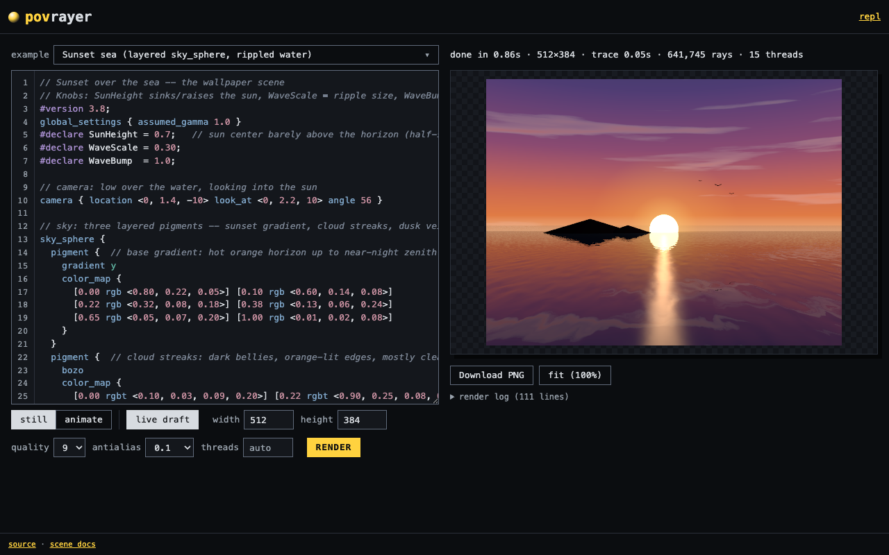
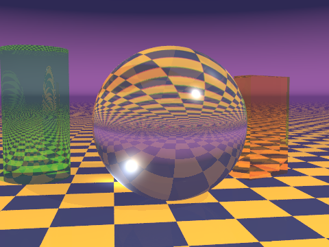
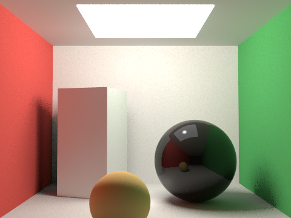
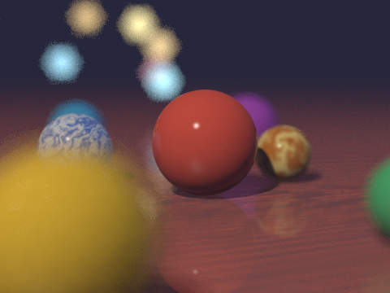
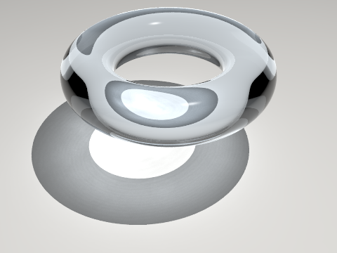
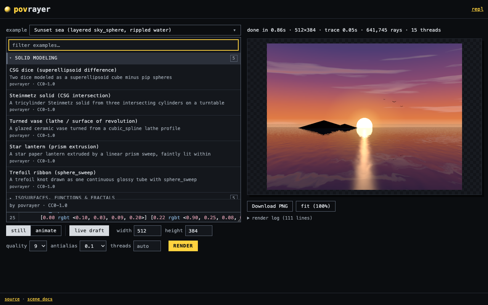
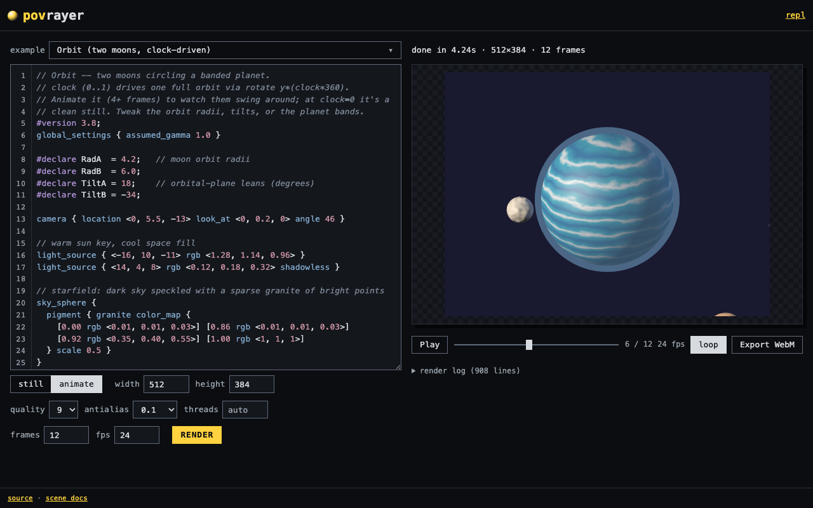
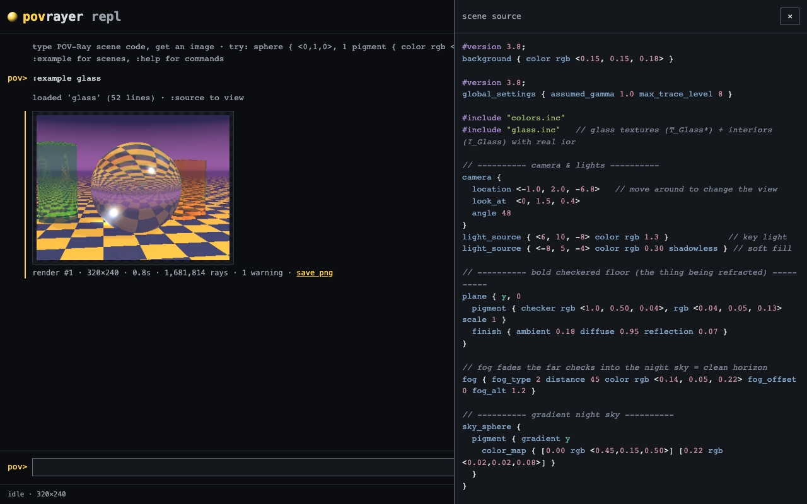

# povrayer

**POV-Ray 3.8, ray-tracing in your browser.** No install, no upload, no server
round-trip: type a scene and watch it render as you go. The exact same
WebAssembly build runs headless in Node and ships as a Docker image.

[](https://github.com/swhitt/povrayer/actions/workflows/ci.yml)
[](https://github.com/swhitt/povrayer/actions/workflows/pages.yml)
[](#license)

### Try it live, no install: [swhitt.github.io/povrayer](https://swhitt.github.io/povrayer/)

[](https://swhitt.github.io/povrayer/)

The browser playground is a real renderer, not a gallery of pre-baked images.
POV-Ray traces every pixel locally on `SharedArrayBuffer`-backed pthreads;
nothing leaves the page.

- **Live draft.** Edit the SDL and it re-renders as you type (debounced, low-res
  preview). Hit Render for the full-quality, downloadable image.
- **Syntax highlighting + validation.** The editor speaks POV-Ray SDL and flags
  the obvious mistakes inline, before you spend a render on them.
- **Animation.** Drive POV-Ray's native `clock` loop, then scrub the frames in a
  built-in player.
- **Examples gallery.** A spread of scenes to fork from (CSG, isosurfaces,
  radiosity, media, depth of field, clock-driven animation, ...).
- **REPL.** An incremental mode where each entry appends to the scene and
  auto-renders, rolling back on error: [repl.html](https://swhitt.github.io/povrayer/repl.html).

Every one of these is ray-traced in the browser, no GPU, no server round-trip:

<p align="center">
  
  
  
  
</p>

One build, three surfaces: the [browser playground](#try-it-in-the-browser), a
[Docker CLI](#render-with-docker), and a small [Node/browser wrapper API](#wrapper-api).

## Try it in the browser

Live, no install: <https://swhitt.github.io/povrayer/> (scene editor) and
<https://swhitt.github.io/povrayer/repl.html> (the SDL REPL: each entry appends
to the scene and auto-renders; a failed entry rolls back).

<p align="center">
  
  
</p>

The REPL builds a scene incrementally and mirrors the assembled source in a
slide-out panel:

<p align="center">
  
</p>

REPL commands: `:help`, `:reset`, `:list`, `:source`, `:undo`, `:del N`,
`:size WxH`, `:q N`, `:aa [threshold|off]`, `:threads N`, `:render`,
`:anim N`, `:example [name]`.

GitHub Pages can't send COOP/COEP headers, so the pages use a vendored
[coi-serviceworker](https://github.com/gzuidhof/coi-serviceworker) to get
cross-origin isolation; the first visit reloads once while the worker installs.

Locally: `make web` builds `dist/` if needed and serves the same pages at
<http://127.0.0.1:8080/> with real COOP/COEP headers (no service worker
involved; the server binds the IPv4 loopback, so use the numeric address).

## Render with docker

Mounted form (local `.inc` files and textures next to the scene resolve):

```sh
docker run --rm --user "$(id -u):$(id -g)" -v "$PWD:/work" ghcr.io/swhitt/povrayer scene.pov
```

The `--user` flag matters on Linux hosts: without it the container runs as
root and the output PNG lands root-owned in your directory.

Streaming form (no mount; scene on stdin, PNG on stdout, logs on stderr):

```sh
cat scene.pov | docker run --rm -i ghcr.io/swhitt/povrayer - -o - > out.png
```

Stdin mode can't resolve local includes (there's no scene directory to
stage), so scenes that need them should use the mounted form. The standard
include library (`colors.inc`, `textures.inc`, ...) works in both modes.

Common options: `-w N` / `-h N` (size), `-o FILE` (output, `-` for stdout),
`-q N` (quality 0..11), `-a [T]` (antialias, optional threshold), `--threads N`,
and `--` to pass raw POV-Ray switches through verbatim. `--help` has the full
list.

Animation: `--frames N` renders N frames as a clock-driven sequence instead of a
single image (`--clock-initial F` / `--clock-final F` set the clock sweep,
defaulting to 0 and 1; the scene's `clock` identifier walks that range). Frames
are written as numbered PNGs (`-o out.png` -> `out01.png`..`outNN.png`, or a `#`
run in the name marks the number slot). `-o -` is rejected with `--frames`,
since frames can't stream to stdout.

If the GHCR image isn't pullable (package not public yet, or you're on a
fork), build it locally with `make image` (or `docker buildx build --target
runtime -t povrayer .`) and use `povrayer` in place of
`ghcr.io/swhitt/povrayer` above.

## Get the wasm bundle

The artifact stage exports the whole bundle:

```sh
docker buildx build --target artifact --output type=local,dest=dist .
```

`dist/` then contains `povray.mjs`, `povray.wasm`, `index.js`, `index.d.ts`,
and `package.json`. No `.data` sidecar and no separate worker file: the
include library is embedded in the wasm.

## Wrapper API

`render()` and `renderAnimation()` are the public API. `render()` takes POV-Ray
SDL source and resolves to the PNG bytes as a fresh `Uint8Array` (never a view
into wasm memory):

```js
import { render } from './dist/index.js';

const png = await render(source, {
  width: 800,
  height: 600,
  antialias: 0.3,
  files: { 'shapes.inc': myInclude }, // extra inputs, staged next to the scene
  onProgress: (line) => console.error(line), // POV-Ray's log, line by line
});
```

On failure it rejects with `PovrayError`, which carries the `exitCode` and
the full captured log on `.log`. An `AbortSignal` via `signal` cancels a
running render; `args` passes raw POV-Ray switches through.

### Animation

`renderAnimation(source, options)` resolves to one PNG per frame (a
`Uint8Array[]`, in numeric frame order), driving POV-Ray's native clock loop
(`+KFI1 +KFF{frames} +KI{initialClock} +KF{finalClock}`):

```js
import { renderAnimation } from './dist/index.js';

const frames = await renderAnimation(source, {
  frames: 24, // required, integer >= 1
  initialClock: 0, // clock at the first frame (default 0)
  finalClock: 1, // clock at the last frame (default 1)
  onFrame: (index, total) => console.error(`frame ${index}/${total}`),
  // ...plus any render() option (width, antialias, signal, args, files, ...)
});
```

The scene animates by reading the `clock` identifier, which sweeps
`initialClock`..`finalClock` across the frames. It inherits every
`RenderOptions` field; an invalid `frames` rejects before any render work.

### Node

Works as-is from `dist/` (Node 20+). Each `render()` call gets a fresh
module instance, and the runtime exits when the render does, so processes
don't hang on leaked worker threads.

### Browser

Same import:

```html
<script type="module">
  import { render } from '/dist/index.js';
  if (!crossOriginIsolated) throw new Error('serve with COOP/COEP headers');
  const png = await render(source, { width: 320, height: 240 });
  imgEl.src = URL.createObjectURL(new Blob([png], { type: 'image/png' }));
</script>
```

Two hard requirements:

1. **Cross-origin isolation.** Threads need `SharedArrayBuffer`, so the page
   must be served with `Cross-Origin-Opener-Policy: same-origin` and
   `Cross-Origin-Embedder-Policy: require-corp`. Check
   `crossOriginIsolated === true` before calling `render()`; if it's false,
   the headers are missing and the wasm won't start.

2. **Don't bundle `povray.mjs`.** Serve `povray.mjs` and `povray.wasm` as
   plain static assets, side by side, names unchanged. The pthread workers
   re-import the module via `new URL(import.meta.url)` and ignore
   `locateFile`, so bundling, renaming, or inlining it breaks worker spawn.
   Mark it external in your bundler and copy both files through untouched.
   (`index.js` itself is safe to bundle.)

## How it's built

POV-Ray 3.8 (pinned to one upstream commit) is compiled to WebAssembly with
Emscripten: pthreads for multithreaded tracing, wasm exception handling, and the
standard include library baked into the binary so there's no `.data` sidecar to
ship. The whole toolchain lives in the `Dockerfile`, whose `artifact` stage
exports the raw bundle and whose `runtime` stage is the CLI image. CI rebuilds
the bundle from source on every push, so `dist/` is a build output, never a
committed blob.

## Bundled macros

The wasm embeds POV-Ray's standard include library (`colors.inc`,
`textures.inc`, `functions.inc`, `rad_def.inc`, ...) plus
[Lightsys IV](https://www.ignorancia.org/index.php?page=lightsys), so scenes can
`#include` them with no setup, in the browser or the CLI:

```pov
#include "CIE.inc"        // CIE XYZ colour-space macros
#include "lightsys.inc"   // physically-based lights from colour temperature / spectra
```

Lightsys IV and the CIE colour-space macros are by Jaime Vives Piqueres and
"Ive" (bundling Philippe Debar's Skylight), licensed
[CC-BY-SA-4.0](https://creativecommons.org/licenses/by-sa/4.0/). The build
downloads the package from the author's site and embeds the include files into
the wasm; the package is not vendored into this repository.

## Memory

The default build declares a 2GB shared-memory maximum (it starts at 256MB and
grows). Safari and iOS can refuse to instantiate a growable shared memory with a
4GB max, so 2GB is the safe default for the browser. Chrome and Firefox treat
the max as mostly address-space reservation, so the published Node CLI image
(no Safari constraint) is built with 4GB for big renders. Rebuild the artifact
with a different ceiling via the build arg:

```sh
docker buildx build --build-arg WASM_MAX_MEMORY=4GB --target artifact --output type=local,dest=dist .
```

## Development

```sh
npm ci            # installs dev deps and wires git hooks (prepare -> core.hooksPath)
make dist         # build the wasm bundle once (cached); tests render against dist/
npm test          # node:test render suite + the 3 Playwright browser suites
```

`npm ci` runs `prepare`, which points `core.hooksPath` at `.githooks/`. If you
ever need to re-wire them by hand, `make hooks`.

### Lint and format

ESLint (flat config, `eslint.config.js`) and Prettier (`.prettierrc.json`) own
style. Browser globals apply under `web/`, Node globals everywhere else; the
wrapper's TypeScript is type-checked by `tsc`, not linted.

```sh
npm run lint          # eslint .
npm run format:check  # prettier --check .
npm run format        # prettier --write .
npm run typecheck     # tsc --noEmit on wrapper/tsconfig.json
```

### Coverage

One merged report spans both runtimes. Node code (the wrapper `dist/index.js`,
`src/cli.mjs`, `test/browser/serve.mjs`, `web/examples.js`) is measured with
c8; the browser modules (`web/render-client.js`, `web/ui.js`, `web/repl.js`,
`web/examples.js`) are measured with Playwright V8 coverage during the browser
suites and converted to istanbul. The two are merged into `coverage/`.

```sh
npm run coverage        # run the whole suite, write coverage/ (final json, lcov, html)
npm run coverage:check  # gate: fail if any first-party file is below 100%
```

The gate also audits `c8 ignore` / `istanbul ignore` pragmas: each must carry a
`-- <reason>`. The excluded files and the rationale live in `.c8rc.json`.

### Git hooks

Committed in `.githooks/`, wired via `core.hooksPath`:

- **pre-commit** (fast): `prettier --check`, `eslint`, `tsc --noEmit` on the
  wrapper, and the fast `*.unit.test.mjs` node subset.
- **pre-push** (slow, authoritative): `eslint`, the full suite under coverage,
  and the 100% `coverage:check` gate.

## License

The image and the wasm artifact embed POV-Ray 3.8, which is licensed
AGPL-3.0-or-later, so the artifact is too. This repository is the complete
corresponding source for that build: the Dockerfile plus the pinned POV-Ray
commit (`c3ce13e5bb51892d8f59c1148b5f905a01ef82f3`) reproduce the artifact
exactly. POV-Ray itself lives at <https://github.com/POV-Ray/povray>.
